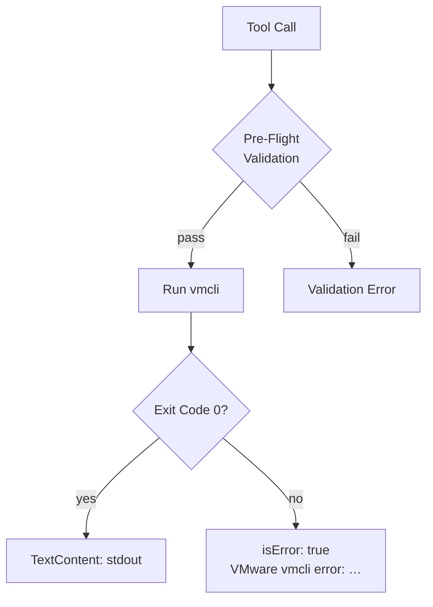

# Error Handling

## Overview

The MCP server always returns a **`CallToolResult`**: it does not crash on `vmcli` errors.



## Success Responses

- **`isError`:** false / unset
- **`content`:** vmcli stdout (often JSON for `query` / `Query` actions)

## Validation Errors (Before vmcli)

| Cause                            | What to Do                                            |
| -------------------------------- | ----------------------------------------------------- |
| Missing `vmx_path` when required | Provide path, `id`, or `display_name` from `vm_list`  |
| Invalid `action`                 | Call `vm_discover_capabilities`; match casing exactly |
| Unresolvable inventory name      | Run `vm_list`; verify spelling                        |

## `vmcli` Errors (`isError: true`)

```
VMware vmcli error: <stderr or stdout text>
```

| Typical Cause       | Fix                                                |
| ------------------- | -------------------------------------------------- |
| VM not found        | Fix `vmx_path`                                     |
| VM wrong state      | Power on for guest ops; check power for stop/start |
| Guest not running   | Start VM before guest file/process actions         |
| Wrong action casing | `query` vs `Query`: see [MCP Tools](mcp-tools.md)  |
| Permission denied   | Check VMware / file access for your user           |

## Timeout Errors

Default: **120 seconds** (`VMCLI_TIMEOUT_SECONDS`). Increase in host `env` for long disk or guest file operations.

## Empty vs Error

| Tool         | Empty Result                 | Error                              |
| ------------ | ---------------------------- | ---------------------------------- |
| `vm_list`    | `[]`: no VMs in search paths | Rare startup failure               |
| Module tools | No                           | `isError: true` with vmcli message |

**Fix empty `vm_list`:** Set `VMCLI_SEARCH_PATHS`: [Configuration](configuration.md).

For symptom → fix tables see [Troubleshooting](troubleshooting.md).
