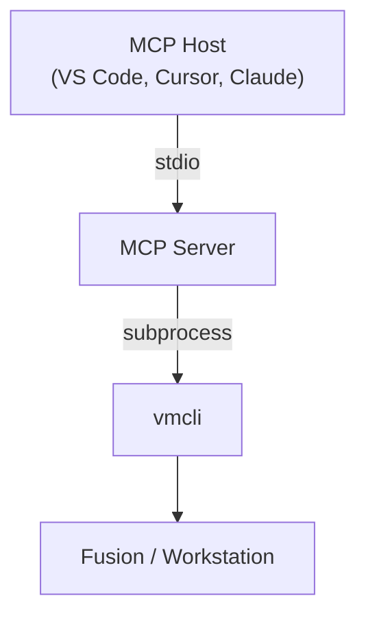

# A Community MCP Server for VMware Desktop Hypervisors

A community MCP server for VMware desktop hypervisors that exposes VMware Fusion and VMware
Workstation operations to MCP hosts through the local `vmcli` CLI.

[](https://pypi.org/project/community-vmware-desktop-hypervisor-mcp-server/)
[](https://pypi.org/project/community-vmware-desktop-hypervisor-mcp-server/)

## Use Cases

- **VM Discovery**: scan disk for `.vmx` files; resolve VMs by display name, id, or path
- **Power Management**: query, start, stop, pause, reset, and suspend VMs from your AI assistant
- **Snapshots**: take, revert, delete, and clone snapshots without leaving the chat
- **Hardware and Config**: disks, network adapters, CPU/memory, and config parameters via `vmcli`
- **Guest Operations**: file transfer, processes, and Tools management when the guest is running
- **Capability Discovery**: live manifest of `vmcli` modules for your installed version

Built for developers who run VMware Fusion or Workstation and want AI agents to operate VMs through MCP.

## Requirements

1. **VMware Fusion 26H1** (macOS) or **VMware Workstation 26H1** (Windows/Linux) with `vmcli`

    ```bash
    vmcli --help
    ```

2. **Python 3.12+** or **[`uv`](https://docs.astral.sh/uv/)**
3. An **MCP host**: Cursor, VS Code, Claude Desktop, Claude Code, or any stdio-compatible client

## Features

- **Broad Coverage**: power, snapshots, VM lifecycle, templates, disks, networking, chipset, guest operations, shared folders, display capture, and configuration, grouped by module rather than one MCP tool per subcommand
- **Inventory**: discover `.vmx` files on disk and resolve VMs by display name, inventory id, or absolute path
- **Version-aware Discovery**: live capability manifest reflects the `vmcli` build installed with Fusion or Workstation
- **Structured Output**: JSON, YAML, or TOML for read/query operations
- **Local and Credential-free**: stdio transport on the machine where the desktop hypervisor runs; no API keys or cloud accounts

## Architecture



## Example Prompts

| Goal            | Try Asking                                                                          |
| --------------- | ----------------------------------------------------------------------------------- |
| Discover VMs    | *"List all virtual machines on this machine."*                                      |
| Power State     | *"What is the power state of virtual machine `ubuntu-2604`?"*                   |
| Power On        | *"Start the virtual machine named `ubuntu-2604`."*                              |
| Power Off       | *"Shut down the virtual machine `ubuntu-2604`."*                                |
| Pause           | *"Pause the virtual machine `ubuntu-2604`."*                                    |
| Suspend         | *"Suspend the virtual machine `ubuntu-2604`."*                                  |
| Reset           | *"Restart the virtual machine `ubuntu-2604`."*                                  |
| Unpause         | *"Unpause the virtual machine `ubuntu-2604`."*                                  |
| IP Address      | *"What is the IP address of the virtual machine `ubuntu-2604`?"*                |
| Guest Info      | *"What operating system is running on virtual machine `ubuntu-2604`?"*          |
| Guest Processes | *"List the running processes on virtual machine `ubuntu-2604`."*                |
| Kill Process    | *"Kill process `1234` on virtual machine `ubuntu-2604`."*                       |
| Guest Files     | *"List the files in `/home/ryan` on virtual machine `ubuntu-2604`."*             |
| Guest Env Vars  | *"What environment variables are set in virtual machine `ubuntu-2604`?"*        |
| Run Command     | *"Run `uname -a` on virtual machine `ubuntu-2604`."*                            |
| CPU and Memory  | *"How much memory and how many CPUs does virtual machine `ubuntu-2604` have?"*  |
| Add Memory      | *"Increase the memory of virtual machine `ubuntu-2604` to 8 GB."*               |
| Add CPU         | *"Increase the vCPU count of virtual machine `ubuntu-2604` to 4."*              |
| Disk Info       | *"List the disks attached to virtual machine `ubuntu-2604`."*                   |
| NVMe Info       | *"What NVMe controllers are configured on virtual machine `ubuntu-2604`?"*      |
| Network Info    | *"What network adapters does virtual machine `ubuntu-2604` have?"*              |
| Config Params    | *"What are the configuration parameters of virtual machine `ubuntu-2604`?"*     |
| Shared Folders  | *"What shared folders are configured on virtual machine `ubuntu-2604`?"*         |
| Screenshot      | *"Take a screenshot of virtual machine `ubuntu-2604`."*                         |
| Set Resolution  | *"Set the display resolution of virtual machine `ubuntu-2604` to 1920×1080."*   |
| List Snapshots  | *"List the snapshots on virtual machine `ubuntu-2604`."*                        |
| Take Snapshot   | *"Snapshot virtual machine `ubuntu-2604` labeled as `baseline`."*               |
| Clone Snapshot  | *"Clone snapshot `baseline` on virtual machine `ubuntu-2604`."*                 |
| Revert Snapshot | *"Revert virtual machine `ubuntu-2604` to snapshot `baseline`."*                |
| Delete Snapshot | *"Delete snapshot `baseline` on virtual machine `ubuntu-2604`."*                |
| Tools Status    | *"What is the VMware Tools status on virtual machine `windows-11`?"*            |
| Install Tools   | *"Install VMware Tools on virtual machine `windows-11`."*                       |
| Tools Version   | *"What version of VMware Tools is installed on virtual machine `windows-11`?"*  |
| Capabilities    | *"What `vmcli` commands are available on this host?"*                           |

## Capabilities

| MCP Primitive | Implementation                                                                                               |
| ------------- | ------------------------------------------------------------------------------------------------------------ |
| **Tools**     | :octicons-check-circle-fill-16:{ style="color: #2b9b46" } [Implemented](getting-started/tools-reference.md) |
| **Resources** | :octicons-x-circle-fill-16:{ style="color: #e5534b" } Not Implemented                                       |
| **Prompts**   | :octicons-x-circle-fill-16:{ style="color: #e5534b" } Not Implemented                                       |
| **Transport** | :octicons-check-circle-fill-16:{ style="color: #2b9b46" } `stdio` Only                                      |                                                          |

## Security

!!! warning
    The MCP server runs `vmcli` with your user privileges.

    An AI assistant with these tools can perform the same actions on a virtual machine as you.

    Only connect **trusted MCP clients** and review destructive tool calls before approving them.

## Sponsor

[](https://github.com/sponsors/tenthirtyam)&nbsp;&nbsp;
[](https://buymeacoffee.com/tenthirtyam)

## License

Copyright &copy; Ryan Johnson.

Licensed under the [MIT License](community/license.md).
